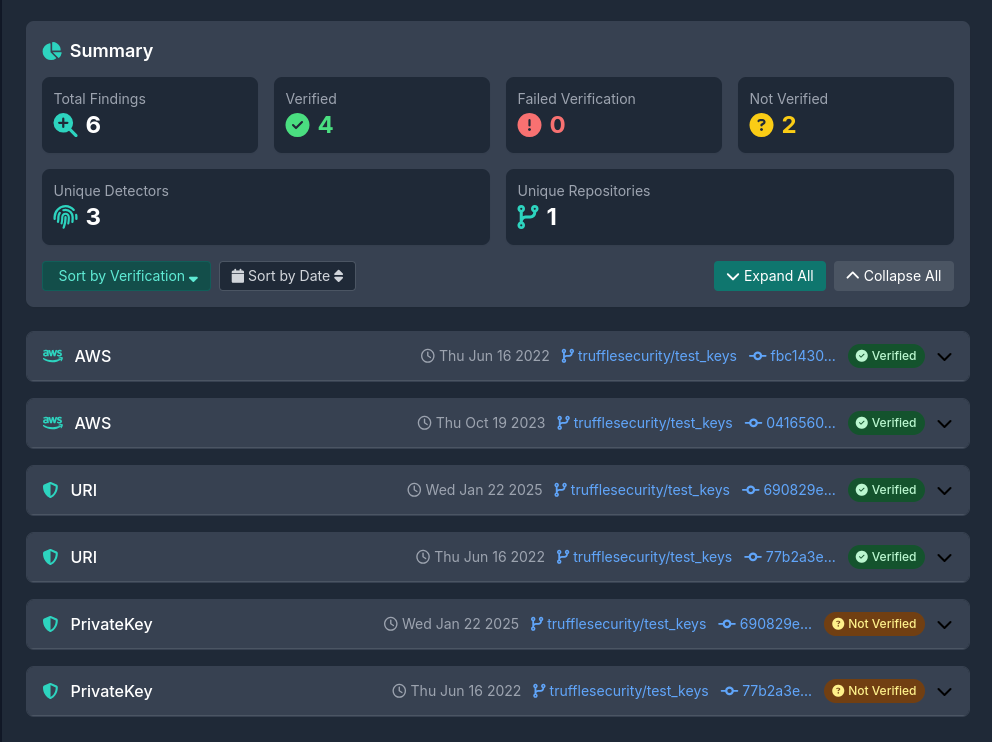

<div align="center">

<h1>TruffleShow</h1>
</div>

A simple web viewer for TruffleHog JSON output.

**Completely client-side**. No data is sent to the server. Actually, there is no server.

- Get the JSON output from TruffleHog
- Upload it to TruffleShow.
- View the results.

Note: TruffleHog produces [a broken JSON file](https://github.com/trufflesecurity/trufflehog/issues/2164). To get a valid JSON file, you can use `jq` like this:

```sh
trufflehog git https://github.com/trufflesecurity/test_keys --json | jq -s . > trufflehog.json
```

Screenshot:



## Roadmap

I am not sure if I will implement these features but here are some ideas:

- [ ] Complete the PDF report generation (currently it is very basic and incomplete)
- [ ] Accept JSON file via text input
- [ ] Generate and export ignore rules for TruffleHog by selecting items
- [ ] Search among the findings
- [ ] Add more TruffleHog sources (e.g. GitLab, Bitbucket, Docker, etc.)

## Feedback and Contributing

This is a very simple tool. I don't plan to add many features but I'm open to suggestions. Feel free to open an issue or send a pull request.

## Development

If you are using `nix flakes`, you can run:

```sh
nix develop
```

and then `serve src` to start a local server.

If not, you can use any static file server to serve the `src` directory. This is just a simple html + javascript project.

## Contributors

<!-- readme: collaborators,contributors -start -->
<table>
	<tbody>
		<tr>
            <td align="center">
                <a href="https://github.com/alioguzhan">
                    
                    <br />
                    <sub><b>Ali Oguzhan Yildiz</b></sub>
                </a>
            </td>
		</tr>
	<tbody>
</table>
<!-- readme: collaborators,contributors -end -->

## License

MIT
